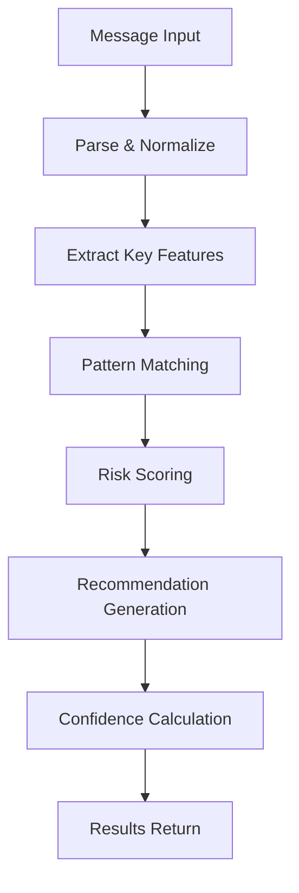

# Epic 007: Semiotic Risk Assessment

## Epic Overview
Implement rule-based semiotic risk assessment for crisis communication messages, providing predictive failure points and actionable recommendations to improve campaign effectiveness. This is CCIP's core innovation that differentiates it from standard crisis communication platforms.

## Epic Status
- **Priority**: Critical (Core Innovation)
- **Phase**: MVP (Primary Feature)
- **Stakeholders**: State Admins, Field Officers, System Admins
- **Dependencies**: Epic 008 (Pattern Database)
- **Estimate**: 3-4 weeks

## Problem Statement
Crisis communication campaigns often fail due to cultural, linguistic, or contextual mismatches that are difficult to predict manually. Organizations need an automated system that can identify potential failure points before campaigns launch and provide specific recommendations to improve effectiveness.

## Solution Overview
Create an intelligent risk assessment engine that analyzes message content against a database of semiotic patterns to predict communication failures and provide actionable recommendations. The system will be rule-based initially (MVP) and evolve with machine learning insights.

## Acceptance Criteria

### AC-001: Risk Assessment Request
- Users can submit message content for semiotic risk assessment
- System accepts target context (region, demographics, language, channel)
- System returns assessment results within 5 seconds (PRD requirement)
- System processes messages in real-time during activity creation

### AC-002: Predictive Failure Points
- System identifies 3-5 specific predicted failure points
- Each failure point includes type and severity classification
- Failure points are culturally and contextually relevant
- System provides evidence from similar historical patterns

### AC-003: Actionable Recommendations
- System provides 3-5 specific, actionable recommendations
- Recommendations are prioritized by impact and ease of implementation
- Users can apply recommendations with one click
- System tracks which recommendations are applied

### AC-004: Confidence Scoring
- Each prediction includes confidence score (70-95%)
- Confidence scores are based on pattern reliability and evidence strength
- System displays confidence intervals for predictions
- Low-confidence assessments trigger manual review

### AC-005: Compliance & Ethics
- System complies with EU AI Act requirements
- Predictions are human-reviewable and explainable
- No personal data is stored beyond assessment results
- Users can contest and provide feedback on predictions

### AC-006: Learning & Improvement
- System tracks prediction accuracy against field outcomes
- Pattern effectiveness updates based on real results
- User feedback refines assessment algorithms
- Anonymous data sharing improves system intelligence

## User Stories

### US-007-001: Assess Message Before Launch
**As a** State Admin
**I want to** assess my campaign message for semiotic risks
**So that** I can identify potential failures before launch

**Acceptance Criteria:**
- [ ] Assessment button available in activity creation workflow
- [ ] Assessment completes within 5 seconds
- [ ] Shows 3-5 failure points with confidence scores
- [ ] Provides 3-5 specific recommendations
- [ ] Displays similar successful campaigns for reference
- [ ] Save assessment results with activity

### US-007-002: Apply Recommendations
**As a** State Admin
**I want to** apply recommended changes to my message
**So that** I can quickly improve effectiveness

**Acceptance Criteria:**
- [ ] Each recommendation has "Apply" button
- [ ] Applied changes update message text immediately
- [ ] User can undo applied changes
- [ ] System logs which recommendations were applied
- [ ] Applied recommendations tracked for effectiveness analysis

### US-007-003: View Assessment History
**As a** State Admin
**I want to** see assessment history and outcomes
**So that** I can learn from past campaigns

**Acceptance Criteria:**
- [ ] Assessment history linked to activities
- [ ] Shows predicted vs actual outcomes
- [ ] Filter assessments by effectiveness score
- [ ] Export assessment reports
- [ ] Compare multiple assessments

### US-007-007: Manual Review Queue
**As a** System Admin
**I want to** review low-confidence assessments
**So that** I can ensure quality predictions

**Acceptance Criteria:**
- [ ] Dashboard for assessments below confidence threshold
- [ ] Can override or mark as reviewed
- [ ] Manual review process documentation
- [ ] Notification system for reviews needed

## Technical Architecture

### Assessment Engine Flow


### API Design
```typescript
// Risk Assessment Request
POST /api/v1/semiotic/assess
{
  "message_content": "Get your COVID vaccine today!",
  "target_context": {
    "region": "west_africa",
    "country": "Nigeria",
    "language": "en",
    "demographics": {
      "age_group": "18-35",
      "urban_rural": "rural",
      "education_level": "mixed"
    },
    "channel": "radio",
    "communication_goal": "behavior_change"
  }
}

// Assessment Response
{
  "success": true,
  "data": {
    "assessment_id": "uuid-v4",
    "overall_risk_score": 72, // 0-100 scale
    "confidence_score": 85, // 70-95%
    "failure_points": [
      {
        "id": "fp_001",
        "type": "linguistic",
        "severity": "medium",
        "description": "Direct imperative may be perceived as disrespectful in cultures with hierarchical communication norms",
        "evidence_strength": "high",
        "pattern_id": "pattern_123"
      },
      {
        "id": "fp_002",
        "type": "cultural",
        "severity": "high",
        "description": "Individual-focused messaging conflicts with collectivist values",
        "evidence_strength": "very_high",
        "pattern_id": "pattern_456"
      }
    ],
    "recommendations": [
      {
        "id": "rec_001",
        "suggestion": "Reframe as community-focused appeal: 'Protect our community with COVID-19 vaccine'",
        "impact_score": 85,
        "ease_implementation": 90,
        "applied": false
      },
      {
        "id": "rec_002",
        "suggestion": "Use local health authority endorsement",
        "impact_score": 75,
        "ease_implementation": 70,
        "applied": false
      }
    ],
    "similar_campaigns": [
      {
        "id": "activity_789",
        "title": "Vaccination Campaign - Northern Region",
        "effectiveness_score": 82,
        "context_match": "85%"
      }
    ],
    "processing_time_ms": 2100
  }
}
```

### Implementation Architecture

#### Core Assessment Engine
```php
class SemioticAssessmentService
{
    private $patternService;
    private $riskScoringEngine;
    private $recommendationEngine;

    public function assessMessage(array $input): AssessmentResult
    {
        // 1. Parse and normalize input
        $normalizedInput = $this->normalizeInput($input);

        // 2. Extract key features for pattern matching
        $features = $this->extractFeatures($normalizedInput);

        // 3. Find matching patterns
        $matches = $this->patternService->findMatches($features, $normalizedInput['context']);

        // 4. Calculate risk scores
        $riskScore = $this->riskScoringEngine->calculateScore($matches);

        // 5. Generate recommendations
        $recommendations = $this->recommendationEngine->generate($riskScore);

        // 6. Calculate overall confidence
        $confidence = $this->calculateConfidence($matches, $riskScore);

        return AssessmentResult::create([
            'failure_points' => $riskScore->getFailurePoints(),
            'recommendations' => $recommendations,
            'confidence_score' => $confidence,
            'processing_time' => $this->getProcessingTime()
        ]);
    }
}
```

#### Pattern Matching Service
```php
class PatternMatchingService
{
    public function findMatches(array $features, array $context): Collection
    {
        // 1. Text-based pattern matching
        $textMatches = $this->textBasedSearch($features['text'], $context);

        // 2. Context-based filtering
        $contextMatches = $this->filterByContext($textMatches, $context);

        // 3. Semantic similarity (future ML enhancement)
        $semanticMatches = $this->semanticSimilarity($features, $contextMatches);

        return $this->rankMatches($semanticMatches);
    }

    private function textBasedSearch(string $text, array $context): Collection
    {
        // Search for keywords, phrases, linguistic patterns
        $keywords = $this->extractKeywords($text);
        $patterns = Pattern::where('status', 'validated')
            ->where(function($query) use ($keywords) {
                foreach ($keywords as $keyword) {
                    $query->orWhere('failed_element', 'ILIKE', "%{$keyword}%")
                         ->orWhere('successful_alternative', 'ILIKE', "%{$keyword}%");
                }
            })
            ->get();

        return $patterns;
    }
}
```

#### Risk Scoring Engine
```php
class RiskScoringEngine
{
    private function calculateFailurePointScore(Pattern $pattern, array $context): array
    {
        $baseScore = $pattern->effectiveness_score * (100 - $pattern->confidence_score) / 100;

        // Context alignment penalty/bonus
        $contextAlignment = $this->calculateContextAlignment($pattern, $context);
        $adjustedScore = $baseScore * $contextAlignment;

        // Severity weighting
        $severityWeights = [
            'cultural' => 1.2,      // Highest impact
            'linguistic' => 1.1,   // High impact
            'technical' => 0.9,     // Medium impact
            'demographic' => 0.8,  // Lower impact
        ];

        $severityWeight = $severityWeights[$pattern->pattern_type] ?? 1.0;

        return [
            'score' => $adjustedScore * $severityWeight,
            'severity' => $this->mapScoreToSeverity($adjustedScore * $severityWeight),
            'confidence' => $pattern->confidence_score,
            'evidence_count' => count($pattern->evidence_sources)
        ];
    }
}
```

### Database Schema Enhancements

#### Assessment Results Storage
```sql
CREATE TABLE semiotic_assessments (
    id UUID PRIMARY KEY DEFAULT gen_random_uuid(),
    activity_id UUID REFERENCES activities(id) ON DELETE CASCADE,

    -- Input Data
    message_content TEXT NOT NULL,
    target_context JSONB NOT NULL DEFAULT '{}',
    features_extracted JSONB NOT NULL DEFAULT '{}',

    -- Assessment Results
    overall_risk_score DECIMAL(5,2) NOT NULL,
    confidence_score DECIMAL(5,2) NOT NULL CHECK (confidence_score >= 70 AND confidence_score <= 95),
    processing_time_ms INTEGER NOT NULL,

    -- Status
    status VARCHAR(20) DEFAULT 'completed', -- 'pending', 'processing', 'completed', 'error', 'manual_review'
    reviewed_by UUID REFERENCES users(id),
    review_notes TEXT,

    created_at TIMESTAMP WITH TIME ZONE DEFAULT NOW(),
    updated_at TIMESTAMP WITH TIME ZONE DEFAULT NOW()
);

CREATE TABLE assessment_failure_points (
    id UUID PRIMARY KEY DEFAULT gen_random_uuid(),
    assessment_id UUID REFERENCES semiotic_assessments(id) ON DELETE CASCADE,
    pattern_id UUID REFERENCES semiotic_patterns(id),

    -- Failure Point Details
    type VARCHAR(50) NOT NULL, -- 'linguistic', 'cultural', 'technical', 'demographic'
    severity VARCHAR(20) NOT NULL, -- 'low', 'medium', 'high', 'critical'
    description TEXT NOT NULL,
    score DECIMAL(5,2) NOT NULL,
    confidence DECIMAL(5,2) NOT NULL,

    -- Evidence
    evidence_strength VARCHAR(20) NOT NULL, -- 'low', 'medium', 'high', 'very_high'

    created_at TIMESTAMP WITH TIME ZONE DEFAULT NOW()
);

CREATE TABLE assessment_recommendations (
    id UUID PRIMARY KEY DEFAULT gen_random_uuid(),
    assessment_id UUID REFERENCES semiotic_assessments(id) ON DELETE CASCADE,

    -- Recommendation Details
    suggestion TEXT NOT NULL,
    impact_score DECIMAL(5,2) NOT NULL,
    ease_implementation DECIMAL(5,2) NOT NULL,
    priority INTEGER NOT NULL,

    -- Status
    applied BOOLEAN DEFAULT FALSE,
    applied_at TIMESTAMP WITH TIME ZONE,
    applied_by UUID REFERENCES users(id),

    -- Outcome Tracking
    effectiveness_measured BOOLEAN DEFAULT FALSE,
    effectiveness_score DECIMAL(5,2),

    created_at TIMESTAMP WITH TIME ZONE DEFAULT NOW(),
    updated_at TIMESTAMP WITH TIME ZONE DEFAULT NOW()
);
```

### Frontend Integration

#### Assessment Modal Component
```vue
<template>
  <q-dialog v-model="show" persistent>
    <q-card class="assessment-modal">
      <q-card-section>
        <div class="text-h6">Semiotic Risk Assessment</div>
      </q-card-section>

      <q-card-section>
        <div v-if="processing" class="text-center">
          <q-spinner color="primary" size="3em" />
          <div class="q-mt-md">Analyzing message...</div>
        </div>

        <div v-else-if="assessment">
          <!-- Risk Score Overview -->
          <div class="risk-score">
            <div class="score-circle" :class="getRiskClass(assessment.overall_risk_score)">
              {{ Math.round(assessment.overall_risk_score) }}%
            </div>
            <div class="score-details">
              <div class="text-caption">Risk Level</div>
              <div class="text-h4">{{ getRiskLabel(assessment.overall_risk_score) }}</div>
              <div class="text-caption">Confidence: {{ assessment.confidence_score }}%</div>
            </div>
          </div>
        </div>
      </q-card-section>

      <q-card-section v-if="assessment && !processing">
        <!-- Failure Points -->
        <div class="q-mb-md">
          <div class="text-h6 q-mb-sm">Predicted Failure Points ({{ assessment.failure_points.length }})</div>
          <q-list dense>
            <q-item v-for="point in assessment.failure_points" :key="point.id">
              <q-item-section avatar>
                <q-avatar :color="getSeverityColor(point.severity)" :icon="getSeverityIcon(point.severity)" size="sm" />
              </q-item-section>

              <q-item-section>
                <q-item-label>{{ point.description }}</q-item-label>
                <q-item-label caption>
                  Type: {{ point.type }} | Confidence: {{ point.confidence }}%
                </q-item-label>
              </q-item-section>

              <q-item-section side>
                <q-chip :color="getSeverityColor(point.severity)" size="sm">
                  {{ point.severity.toUpperCase() }}
                </q-chip>
              </q-item-section>
            </q-item>
          </q-list>
        </div>

        <!-- Recommendations -->
        <div class="q-mb-md">
          <div class="text-h6 q-mb-sm">Recommendations ({{ assessment.recommendations.length }})</div>
          <q-list>
            <q-item v-for="rec in assessment.recommendations" :key="rec.id">
              <q-item-section>
                <q-item-label>{{ rec.suggestion }}</q-item-label>
                <q-item-label caption>
                  Impact: {{ Math.round(rec.impact_score) }}% |
                  Ease: {{ Math.round(rec.ease_implementation) }}%
                </q-item-label>
              </q-item-section>

              <q-item-section side>
                <q-btn
                  v-if="!rec.applied"
                  color="primary"
                  size="sm"
                  @click="applyRecommendation(rec)"
                  :loading="applying === rec.id"
                >
                  Apply
                </q-btn>
                <q-btn
                  v-else
                  color="secondary"
                  size="sm"
                  @click="undoRecommendation(rec)"
                >
                  Applied
                </q-btn>
              </q-item-section>
            </q-item>
          </q-list>
        </div>

        <!-- Similar Campaigns -->
        <div v-if="assessment.similar_campaigns.length">
          <div class="text-h6 q-mb-sm">Similar Successful Campaigns</div>
          <q-list dense>
            <q-item v-for="campaign in assessment.similar_campaigns" :key="campaign.id">
              <q-item-section>
                <q-item-label>{{ campaign.title }}</q-item-label>
                <q-item-label caption>
                  Effectiveness: {{ campaign.effectiveness_score }}% |
                  Context Match: {{ campaign.context_match }}%
                </q-item-label>
              </q-item-section>
            </q-item>
          </q-list>
        </div>
      </q-card-section>

      <q-card-actions align="right">
        <q-btn flat color="primary" @click="saveAssessment">Save Assessment</q-btn>
        <q-btn color="primary" @click="close">Close</q-btn>
      </q-card-actions>
    </q-card>
  </q-dialog>
</template>
```

## Dependencies

### Technical Dependencies
- Epic 008 (Pattern Database) - Core dependency
- PostgreSQL with pgvector for semantic search
- Redis for caching assessment results
- Laravel Queues for background processing

### Feature Dependencies
- Epic 002 (Activity Tracking) - Integration point
- Epic 004 (Communication System) - Notification triggers
- Epic 003 (Dashboard & Analytics) - Assessment visualization

### External Dependencies
- None initially (rule-based)
- Optional: Third-party semiotic research databases

## Risks & Mitigations

### Risk 1: False Positives
**Mitigation**: Multi-stage validation, confidence scoring, manual review for low-confidence assessments

### Risk 2: Cultural Generalization
**Mitigation**: Diverse pattern validation, regional validation teams, context-specific weighting

### Risk 3: Performance Bottlenecks
**Mitigation**: Async processing, result caching, optimized algorithms

### Risk 4: User Trust
**Mitigation**: Transparent explanations, evidence-based predictions, feedback mechanisms

## Success Metrics

### Technical Metrics
- Assessment response time: <5 seconds (PRD requirement)
- Pattern matching accuracy: 90%+
- System availability: 99.5%
- Concurrent assessments: 100+ per minute

### Business Metrics
- Campaign effectiveness improvement: 30-50% (validated)
- User adoption: 90% of activities use assessment
- Recommendation application rate: 70%+
- Assessment accuracy: 75%+ (validated against outcomes)

### Product Metrics
- User satisfaction: 4.5/5 average rating
- Learning rate: 50+ patterns added monthly from feedback
- False positive rate: <10%
- Manual review rate: <5%

## Definition of Done

- [ ] Assessment engine implemented with rule-based algorithms
- [ ] API endpoints created and tested
- [ ] Frontend assessment modal integrated
- [ ] Pattern database integration complete
- [ ] Performance benchmarks met (<5s response)
- [ ] 100+ initial patterns seeded from research
- [ ] Documentation created
- [ ] Admin dashboard for review queue
- [ ] User training materials provided

## Rollout Plan

### Phase 1: Core Engine (Week 1-2)
- Assessment engine implementation
- Basic pattern matching algorithms
- API endpoints for assessments
- Simple frontend integration

### Phase 2: Advanced Features (Week 2-3)
- Confidence scoring system
- Recommendation engine
- Performance optimization
- Assessment result caching

### Phase 3: User Experience (Week 3-4)
- Assessment modal UI
- One-click recommendations
- Assessment history tracking
- Analytics dashboard

### Phase 4: Integration & Testing (Week 4)
- Integration with activity creation workflow
- End-to-end testing
- Performance load testing
- User acceptance testing

## Post-Implementation Considerations

### Enhancement Opportunities
- Machine learning pattern matching (Phase 2)
- Real-time assessment during message composition
- Advanced visualization of risk factors
- Automated pattern extraction from field reports
- Cross-organization pattern learning

### Maintenance
- Regular accuracy monitoring and calibration
- Pattern validation workflow maintenance
- User feedback collection and analysis
- Performance monitoring and optimization

---

**Epic Owner**: Product & AI Teams
**Business Stakeholder**: State Administrators
**Technical Lead**: Backend Lead
**UX Lead**: Frontend Lead
**AI Consultant**: Semiotic Analysis Expert
**Created**: 2025-12-14
**Last Updated**: 2025-12-14