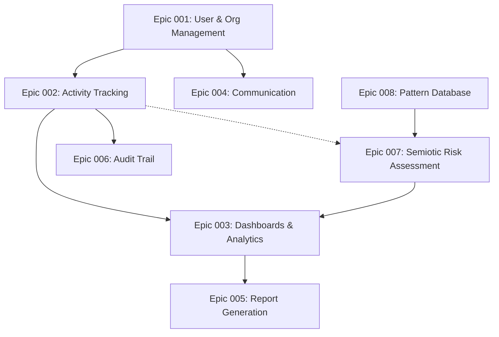

# CCIP Implementation Roadmap & Priority Order

## Executive Summary

This document outlines the recommended implementation order for all CCIP epics, focusing on delivering value quickly while building the foundation for the core innovation (Semiotic Risk Assessment).

## Priority Matrix

| Priority | Epic | Dependencies | Estimated Effort | Value Score |
|----------|------|--------------|------------------|-------------|
| **P0** | Epic 001: User & Organisation Management | None | 3 weeks | Critical |
| **P0** | Epic 002: Activity Tracking (Enhanced) | Epic 001 | 4 weeks | Critical |
| **P1** | Epic 008: Pattern Database | None (Foundation) | 3 weeks | High |
| **P1** | Epic 004: Communication | Epic 001 | 2 weeks | High |
| **P2** | Epic 007: Semiotic Risk Assessment | Epic 008 | 4 weeks | Critical (Core) |
| **P2** | Epic 003: Dashboards & Analytics | Epic 002 | 3 weeks | High |
| **P3** | Epic 005: Report Generation | Epic 003 | 2 weeks | Medium |
| **P3** | Epic 006: Audit Trail | Epic 001, 002 | 1 week | Medium |

## Phase-Based Implementation Plan

### Phase 1: Foundation (Sprints 1-3)
**Duration: 6 weeks**
**Goal: Basic functional platform ready for field testing**

#### Sprint 1 (Weeks 1-2): User Management & Authentication
- **Epic 001**: User & Organisation Management
  - User registration and authentication
  - Organization hierarchy setup
  - Role-based permissions (Super Admin → User)
  - Multi-tenancy support

#### Sprint 2 (Weeks 3-4): Core Activity Tracking
- **Epic 002**: Activity Tracking & Reporting (Base Features)
  - Activity creation and management
  - Evidence file uploads
  - Basic reporting templates
  - Activity timeline view

#### Sprint 3 (Weeks 5-6): Communication Foundation
- **Epic 004**: Communication (Core Features)
  - Internal messaging system
  - Basic notifications
  - Email notifications for activity submissions

**Phase 1 Deliverables:**
- Working authentication system
- Users can create and track activities
- File upload functionality
- Basic internal communication
- Ready for limited field testing

### Phase 2: Intelligence Foundation (Sprints 4-5)
**Duration: 4 weeks**
**Goal: Build the pattern database for future AI capabilities**

#### Sprint 4 (Weeks 7-8): Pattern Database
- **Epic 008**: Pattern Database
  - Pattern storage and management
  - Validation workflow
  - Search and filtering
  - Admin UI for pattern management
  - Seed initial pattern dataset from research

#### Sprint 5 (Weeks 9-10): Enhanced Activity Features
- **Epic 002**: Activity Tracking (Enhanced Features)
  - Effectiveness metrics recording
  - GPS location tagging
  - Offline sync capabilities
  - Mobile optimization

**Phase 2 Deliverables:**
- Complete pattern database
- Enhanced activity tracking with metrics
- GPS-enabled activity mapping
- Offline functionality for low-connectivity areas

### Phase 3: Core Innovation (Sprints 6-7)
**Duration: 4 weeks**
**Goal: Implement Semiotic Risk Assessment - CCIP's core differentiator**

#### Sprint 6 (Weeks 11-12): Risk Assessment Engine
- **Epic 007**: Semiotic Risk Assessment (Backend)
  - Pattern matching algorithm
  - Risk scoring engine
  - Assessment API endpoints
  - Integration with activity creation flow

#### Sprint 7 (Weeks 13-14): Risk Assessment UI
- **Epic 007**: Semiotic Risk Assessment (Frontend)
  - Risk assessment modal
  - Interactive results display
  - Mitigation strategy suggestions
  - Pattern visualization

**Phase 3 Deliverables:**
- Fully functional semiotic risk assessment
- Real-time risk scoring for activities
- Evidence-based mitigation strategies
- Complete ML/AI pipeline

### Phase 4: Analytics & Reporting (Sprints 8-9)
**Duration: 4 weeks**
**Goal: Comprehensive analytics and reporting capabilities**

#### Sprint 8 (Weeks 15-16): Dashboards & Analytics
- **Epic 003**: Dashboards & Analytics
  - Activity analytics dashboard
  - Geographic distribution maps
  - Effectiveness metrics visualization
  - Real-time data synchronization

#### Sprint 9 (Weeks 17-18): Report Generation
- **Epic 005**: Report Generation
  - Automated report creation
  - Custom report templates
  - Export capabilities (PDF, CSV)
  - Scheduled report generation

**Phase 4 Deliverables:**
- Comprehensive analytics dashboard
- Automated reporting system
- Data visualization tools
- Executive reporting capabilities

### Phase 5: Compliance & Optimization (Sprint 10)
**Duration: 1 week**
**Goal: Final compliance and optimization features**

#### Sprint 10 (Week 19): Audit Trail & Polish
- **Epic 006**: Audit Trail
  - Complete activity audit logs
  - User action tracking
  - Compliance reporting
- Performance optimization
- Security hardening
- Documentation completion

**Phase 5 Deliverables:**
- Complete audit trail system
- Production-ready application
- Full documentation
- Security certifications preparation

## Critical Path Analysis

### Must-Have Features for MVP
1. **User Authentication & Organization Management** (Epic 001)
2. **Basic Activity Tracking** (Epic 002 core features)
3. **Pattern Database** (Epic 008) - Foundation for innovation
4. **Semiotic Risk Assessment** (Epic 007) - Core differentiator

### Can Be Deferred Post-MVP
1. Advanced Analytics (Epic 003 advanced features)
2. Automated Report Generation (Epic 005)
3. Detailed Audit Trail (Epic 006)

## Implementation Dependencies

## Resource Allocation Recommendations

### Development Team Structure
- **Backend Developer** (1): Focus on APIs, database, and ML/AI integration
- **Frontend Developer** (1): Vue 3 + Quasar application
- **UI/UX Designer** (0.5): Design system and user experience
- **DevOps Engineer** (0.5): Infrastructure and deployment
- **QA Engineer** (0.5): Testing and quality assurance

### Sprint Capacity Planning
- Each sprint: 2 weeks
- Total duration: 19 weeks (approx. 5 months)
- Team velocity: Adjust based on actual sprint performance

## Risk Mitigation Strategies

### Technical Risks
1. **Vector Search Implementation**
   - Mitigation: Start with text-based search, add vector search later
   - Alternative: Use PostgreSQL pgvector or external search service

2. **ML/AI Model Performance**
   - Mitigation: Begin with rule-based pattern matching
   - Alternative: Use external AI service for initial implementation

3. **Offline Sync Complexity**
   - Mitigation: Implement basic online version first
   - Phase 2: Add offline capabilities

### Business Risks
1. **Pattern Data Quality**
   - Mitigation: Start with curated research patterns
   - Plan: Crowdsource patterns from field reports

2. **User Adoption**
   - Mitigation: Early field testing with pilot users
   - Plan: Comprehensive user training materials

## Success Metrics

### Phase 1 Success Criteria
- [ ] 100+ users can create and manage activities
- [ ] 500+ activities tracked in pilot program
- [ ] File uploads working reliably (95% success rate)

### Phase 2 Success Criteria
- [ ] 50+ validated patterns in database
- [ ] GPS tagging working in test locations
- [ ] Offline sync functioning for 10+ users

### Phase 3 Success Criteria
- [ ] Risk assessment accuracy >75% (based on expert validation)
- [ ] Assessment processing time <5 seconds
- [ ] User satisfaction score >4/5 for risk insights

### Full Implementation Success
- [ ] 1000+ activities processed through risk assessment
- [ ] Documented improvement in communication effectiveness
- [ ] Platform deployed in 3+ countries

## Next Steps

1. **Immediate Actions (Week 0)**
   - Set up development environment
   - Create detailed sprint plans for Phase 1
   - Prepare database for migrations
   - Set up CI/CD pipeline

2. **Week 1 Priorities**
   - Start Epic 001 implementation
   - Set up authentication system
   - Create basic UI components
   - Begin user testing preparation

3. **Continuous Improvement**
   - Weekly retrospectives to adjust plan
   - Monthly stakeholder reviews
   - Quarterly roadmap reassessment
   - Continuous user feedback integration

---

*Document created: December 14, 2025*
*Last updated: December 14, 2025*
*Next review: January 11, 2026*