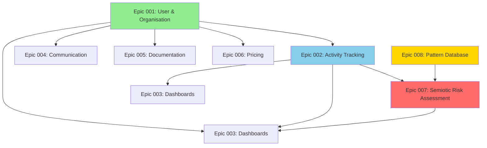

# CCIP Phased Implementation Plan

**Version:** 2.0  
**Date:** December 15, 2025  
**Status:** Ready for Implementation  
**Architect:** Winston (System Architect)

---

## Executive Summary

This document provides a comprehensive phased implementation plan for CCIP, covering all 8 epics with detailed dependency analysis, effort estimates, risk assessment, and a clear roadmap. The plan prioritises foundation features while ensuring the core innovation (Semiotic Risk Assessment) is delivered early in the MVP.

**Key Metrics:**
- **Total Estimated Duration:** 20 weeks (5 months)
- **Total Epics:** 8
- **Critical Path:** Epic 001 → Epic 002 → Epic 008 → Epic 007
- **MVP Readiness:** Week 14 (with core innovation)

---

## 1. Epic Dependency Analysis

### 1.1 Dependency Graph



**Legend:**
- 🟢 **Green (Epic 001):** Foundation - No dependencies
- 🟡 **Gold (Epic 008):** Foundation for intelligence - No dependencies
- 🔴 **Red (Epic 007):** Core innovation - Depends on Epic 008
- 🔵 **Blue (Epic 002):** Core functionality - Depends on Epic 001

### 1.2 Dependency Matrix

| Epic | Depends On | Blocks | Can Start After |
|------|------------|--------|-----------------|
| **001** | None | 002, 003, 004, 005, 006 | Week 0 |
| **002** | 001 | 003, 007 | Week 3 |
| **003** | 001, 002 | 005 | Week 7 |
| **004** | 001 | None | Week 3 |
| **005** | 001, 003 | None | Week 10 |
| **006** | 001, 002 | None | Week 7 |
| **007** | 008, 002 | 003 | Week 11 |
| **008** | None | 007 | Week 0 (parallel with 001) |

### 1.3 Critical Path Analysis

**Critical Path (Longest Path):**
```
Epic 001 (3 weeks) → Epic 002 (4 weeks) → Epic 008 (3 weeks) → Epic 007 (4 weeks) → Epic 003 (3 weeks)
Total: 17 weeks
```

**Parallel Opportunities:**
- Epic 001 and Epic 008 can run in parallel (both foundation, no dependencies)
- Epic 004 can start immediately after Epic 001 (Week 3)
- Epic 006 can start after Epic 002 completes (Week 7)

---

## 2. Epic Prioritisation & Phasing

### 2.1 Priority Classification

| Priority | Epic | Rationale | Phase |
|----------|------|-----------|-------|
| **P0 - Critical** | Epic 001: User & Organisation | Foundation for all features | Phase 1 |
| **P0 - Critical** | Epic 002: Activity Tracking | Core platform functionality | Phase 1 |
| **P0 - Critical** | Epic 008: Pattern Database | Foundation for intelligence | Phase 1 |
| **P0 - Critical** | Epic 007: Semiotic Risk Assessment | Core innovation & differentiator | Phase 2 |
| **P1 - High** | Epic 004: Communication | Essential for coordination | Phase 1 |
| **P1 - High** | Epic 003: Dashboards & Analytics | Required for insights | Phase 2 |
| **P2 - Medium** | Epic 005: Documentation | Important for adoption | Phase 3 |
| **P2 - Medium** | Epic 006: Pricing & Subscription | Business sustainability | Phase 3 |

### 2.2 MVP Definition

**MVP Must-Have Features:**
1. ✅ User authentication & organisation management (Epic 001)
2. ✅ Activity tracking with evidence uploads (Epic 002)
3. ✅ Pattern database for semiotic intelligence (Epic 008)
4. ✅ Semiotic risk assessment engine (Epic 007)
5. ✅ Basic communication system (Epic 004)

**MVP Nice-to-Have (Can Defer):**
- Advanced dashboards & analytics (Epic 003 - basic version in MVP)
- Comprehensive documentation system (Epic 005)
- Pricing & subscription management (Epic 006)

---

## 3. Phased Implementation Plan

### Phase 1: Foundation & Core Platform (Weeks 1-10)
**Goal:** Establish foundation and core platform functionality

#### Sprint 1-2: Foundation Setup (Weeks 1-3)
**Epic 001: User & Organisation Management**
- **Effort:** 3 weeks
- **Team:** 1 Backend Dev, 1 Frontend Dev
- **Deliverables:**
  - User registration & authentication (Laravel Sanctum)
  - Organisation hierarchy (parent-child relationships)
  - Role-based access control (4-tier system)
  - User profile management
  - Multi-tenancy support

**Parallel Track:**
**Epic 008: Pattern Database** (Weeks 1-3)
- **Effort:** 3 weeks
- **Team:** 1 Backend Dev (can overlap with Epic 001)
- **Deliverables:**
  - Pattern database schema (PostgreSQL + pgvector)
  - Pattern CRUD operations
  - Pattern validation workflow
  - Admin UI for pattern management
  - Initial pattern seeding (50+ patterns from research)

#### Sprint 3-4: Core Activity Tracking (Weeks 4-7)
**Epic 002: Activity Tracking & Reporting (Enhanced)**
- **Effort:** 4 weeks
- **Team:** 1 Backend Dev, 1 Frontend Dev
- **Dependencies:** Epic 001 complete
- **Deliverables:**
  - Activity creation & management workflow
  - Evidence file uploads (S3/MinIO integration)
  - Activity submission & approval workflow
  - GPS location tagging
  - Effectiveness metrics capture (Understanding Score, Compliance, Barriers)
  - Offline sync capabilities (PWA service worker)
  - Activity timeline & status tracking

#### Sprint 5: Communication System (Weeks 8-10)
**Epic 004: Communication System**
- **Effort:** 2 weeks
- **Team:** 1 Backend Dev, 1 Frontend Dev
- **Dependencies:** Epic 001 complete
- **Deliverables:**
  - Internal messaging (one-on-one & group)
  - Organisation-level messaging
  - Real-time notifications (WebSocket or polling)
  - Notification preferences
  - Urgent alerts system

**Phase 1 Deliverables:**
- ✅ Complete authentication & authorisation system
- ✅ Organisation hierarchy management
- ✅ Activity tracking with evidence uploads
- ✅ Pattern database foundation
- ✅ Basic communication system
- ✅ Ready for field testing

---

### Phase 2: Core Innovation (Weeks 11-14)
**Goal:** Implement semiotic risk assessment - CCIP's core differentiator

#### Sprint 6-7: Semiotic Risk Assessment (Weeks 11-14)
**Epic 007: Semiotic Risk Assessment**
- **Effort:** 4 weeks
- **Team:** 1 Backend Dev, 1 Frontend Dev, 0.5 ML Engineer (consultation)
- **Dependencies:** Epic 008 complete, Epic 002 complete
- **Deliverables:**
  - Pattern matching engine (rule-based MVP)
  - Risk scoring algorithm
  - Failure point identification (3-5 per assessment)
  - Recommendation generation (3-5 actionable items)
  - Confidence scoring (70-95% range)
  - Assessment API endpoints
  - Assessment UI integration (modal in activity creation)
  - One-click recommendation application
  - Similar campaigns view

**Phase 2 Deliverables:**
- ✅ Fully functional semiotic risk assessment
- ✅ Real-time risk scoring during activity creation
- ✅ Evidence-based mitigation strategies
- ✅ Complete MVP ready for pilot deployment

---

### Phase 3: Analytics & Enhancement (Weeks 15-20)
**Goal:** Add analytics, documentation, and business features

#### Sprint 8-9: Dashboards & Analytics (Weeks 15-17)
**Epic 003: Dashboards & Analytics**
- **Effort:** 3 weeks
- **Team:** 1 Backend Dev, 1 Frontend Dev
- **Dependencies:** Epic 001, Epic 002, Epic 007
- **Deliverables:**
  - Role-based dashboards (4 different views)
  - Activity status tracking & visualisation
  - Activity heatmap (time-based, not geographic)
  - Engagement analytics
  - Effectiveness metrics visualisation
  - Export capabilities (CSV, PDF)
  - Real-time data updates

#### Sprint 10: Documentation & Pricing (Weeks 18-20)
**Epic 005: Documentation & Help System**
- **Effort:** 2 weeks
- **Team:** 1 Frontend Dev, 0.5 Tech Writer
- **Dependencies:** Epic 001 (for role-based content)
- **Deliverables:**
  - Developer API documentation (OpenAPI/Swagger)
  - User help guides
  - Interactive onboarding tour
  - In-app help system
  - Contextual help tooltips

**Epic 006: Pricing & Subscription Management**
- **Effort:** 1 week
- **Team:** 1 Backend Dev, 1 Frontend Dev
- **Dependencies:** Epic 001 (organisations)
- **Deliverables:**
  - Pricing page with tier comparison
  - Free tier management (50-100 member limit)
  - Premium tier subscription (stripe integration)
  - Subscription status tracking
  - Feature gating based on subscription tier

**Phase 3 Deliverables:**
- ✅ Comprehensive analytics dashboard
- ✅ Complete documentation system
- ✅ Pricing & subscription management
- ✅ Production-ready platform

---

## 4. Effort Estimation & Timeline

### 4.1 Epic Effort Breakdown

| Epic | Backend | Frontend | Testing | Total | Duration |
|------|---------|----------|---------|-------|----------|
| **001** | 2 weeks | 1 week | 0.5 weeks | 3.5 weeks | 3 weeks |
| **002** | 2.5 weeks | 1.5 weeks | 1 week | 5 weeks | 4 weeks |
| **003** | 1.5 weeks | 1.5 weeks | 0.5 weeks | 3.5 weeks | 3 weeks |
| **004** | 1 week | 1 week | 0.5 weeks | 2.5 weeks | 2 weeks |
| **005** | 0.5 weeks | 1 week | 0.5 weeks | 2 weeks | 2 weeks |
| **006** | 0.5 weeks | 0.5 weeks | 0.25 weeks | 1.25 weeks | 1 week |
| **007** | 2 weeks | 1.5 weeks | 0.5 weeks | 4 weeks | 4 weeks |
| **008** | 2 weeks | 1 week | 0.5 weeks | 3.5 weeks | 3 weeks |
| **Total** | 12 weeks | 9 weeks | 4.25 weeks | 25.25 weeks | **20 weeks** |

**Note:** Parallel work reduces total duration from 25.25 weeks to 20 weeks.

### 4.2 Resource Allocation

**Team Composition:**
- **Backend Developer (1 FTE):** Laravel API, database, integrations
- **Frontend Developer (1 FTE):** Vue 3 + Quasar, PWA, UI/UX
- **ML Engineer (0.25 FTE):** Consultation for pattern matching, risk scoring
- **Tech Writer (0.25 FTE):** Documentation (Epic 005)
- **QA Engineer (0.5 FTE):** Testing across all epics

**Sprint Capacity:**
- **Sprint Duration:** 2 weeks
- **Total Sprints:** 10 sprints
- **Team Velocity:** Adjust based on actual performance

---

## 5. Technical Risk Assessment

### 5.1 High-Risk Areas

#### 🔴 **Critical Risks**

**1. Semiotic Risk Assessment Accuracy**
- **Risk:** Pattern matching may produce inaccurate predictions
- **Impact:** Core innovation fails, user trust lost
- **Probability:** Medium
- **Mitigation:**
  - Start with rule-based system (validated by domain experts)
  - Implement confidence scoring (flag low-confidence predictions)
  - Human-in-the-loop validation workflow
  - Continuous pattern validation from field data
- **Contingency:** Manual review process for all assessments initially

**2. Assessment Response Time (< 5 seconds)**
- **Risk:** Complex pattern matching exceeds 5-second requirement
- **Impact:** Poor user experience, PRD violation
- **Probability:** Medium
- **Mitigation:**
  - Implement Redis caching for common patterns
  - Optimize database queries (indexes, query optimization)
  - Use background jobs for complex analyses
  - Pre-compute common pattern matches
- **Contingency:** Show loading state, allow async processing

**3. Offline Sync Complexity**
- **Risk:** PWA offline sync may have data conflicts or loss
- **Impact:** Field officers lose work, data inconsistency
- **Probability:** High
- **Mitigation:**
  - Start with online-only version
  - Implement conflict resolution strategy (last-write-wins with manual merge option)
  - Comprehensive testing in low-connectivity scenarios
  - Clear user feedback on sync status
- **Contingency:** Manual data entry fallback, export/import functionality

---

## 6. Next Steps & Immediate Actions

### 6.1 Pre-Implementation (Week 0)

**Infrastructure Setup:**
- [ ] Set up development environment (Docker Compose)
- [ ] Configure PostgreSQL with pgvector extension
- [ ] Set up MinIO for S3-compatible storage
- [ ] Configure Redis for caching
- [ ] Set up CI/CD pipeline (GitHub Actions)
- [ ] Create development database with seed data

**Team Preparation:**
- [ ] Review all epic specifications with team
- [ ] Create detailed sprint plans for Phase 1
- [ ] Set up project management tools (Jira/GitHub Projects)
- [ ] Schedule daily standups and sprint planning
- [ ] Assign epic ownership

---

**Document Status:** ✅ Approved for Implementation  
**Next Review Date:** January 15, 2026  
**Owner:** System Architect (Winston)

---

*This plan is a living document. Update as implementation progresses and new insights emerge.*
